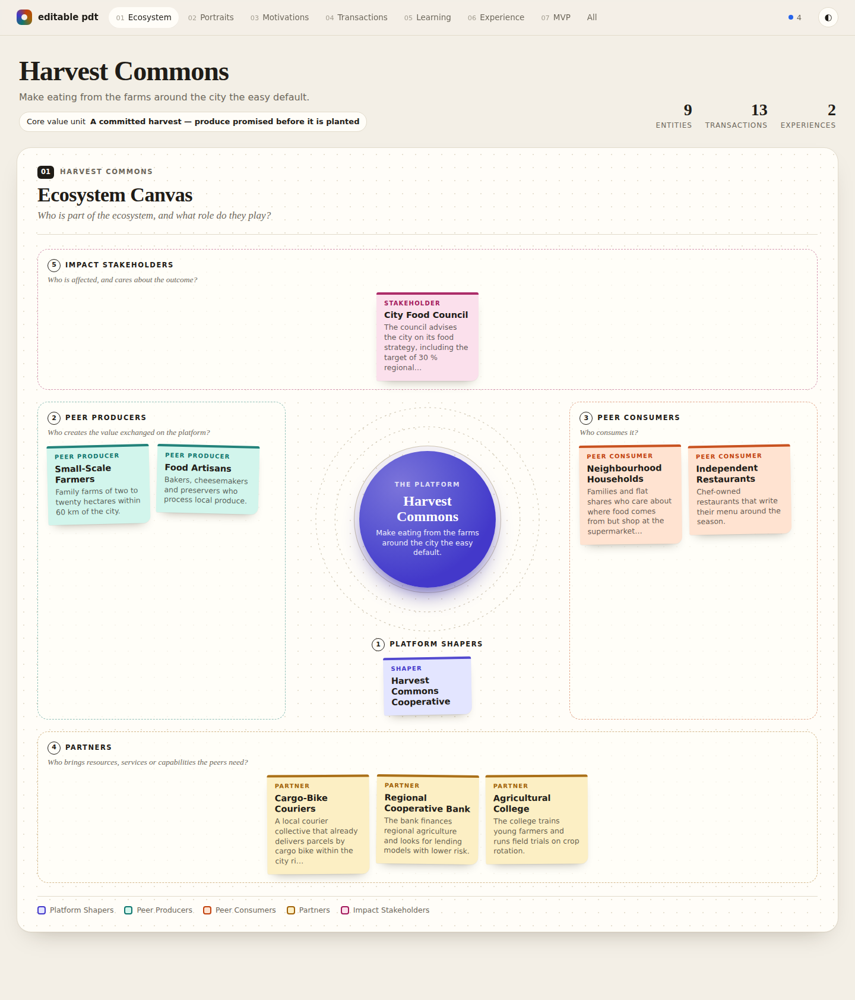
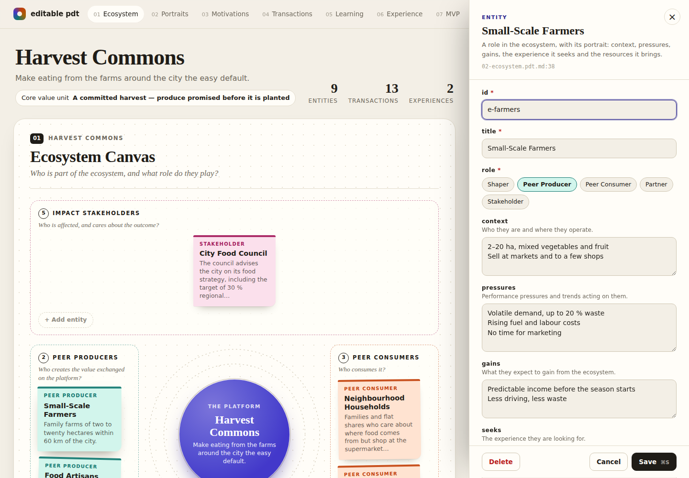
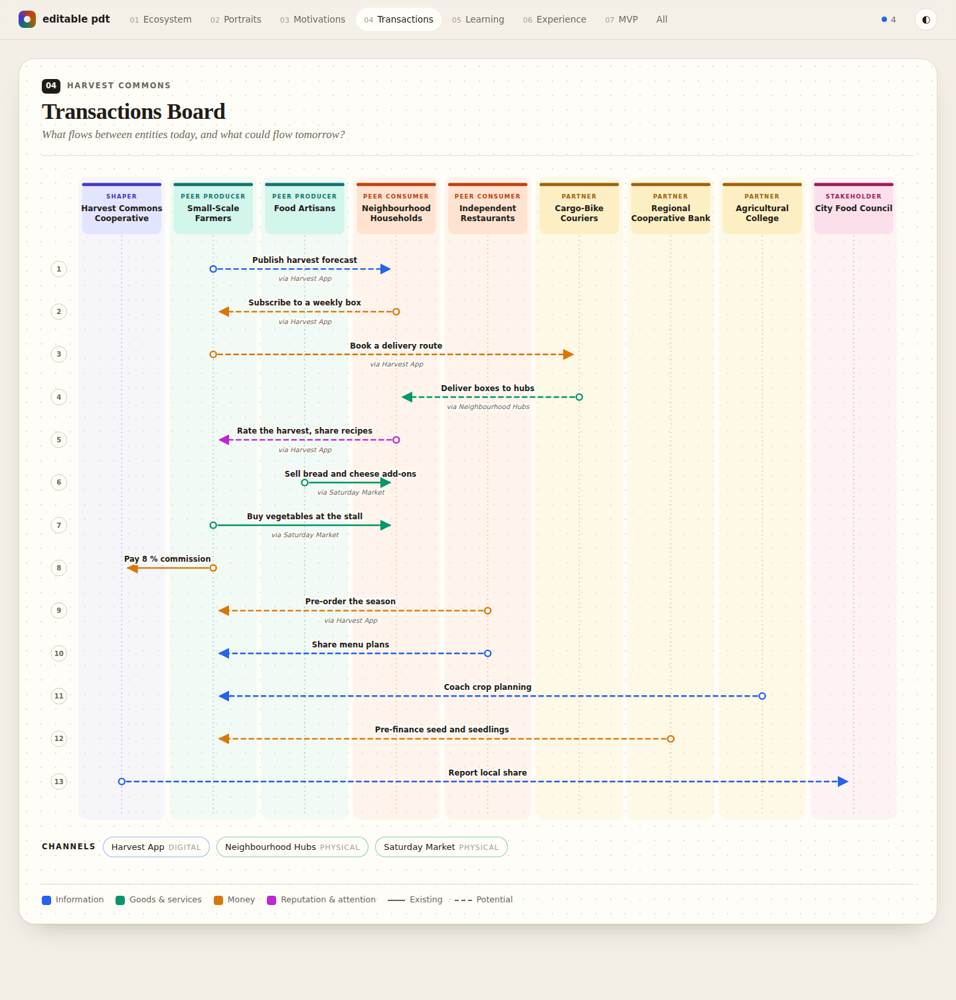
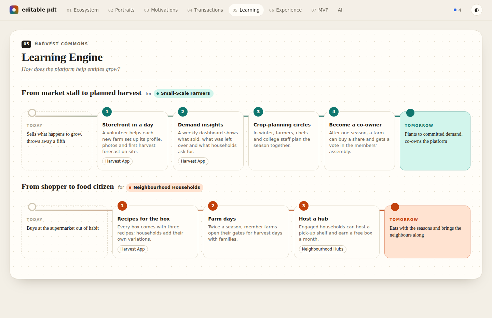
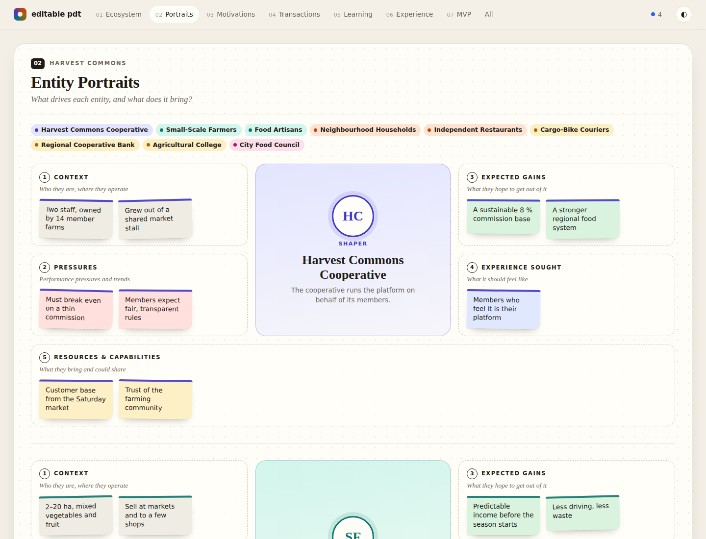
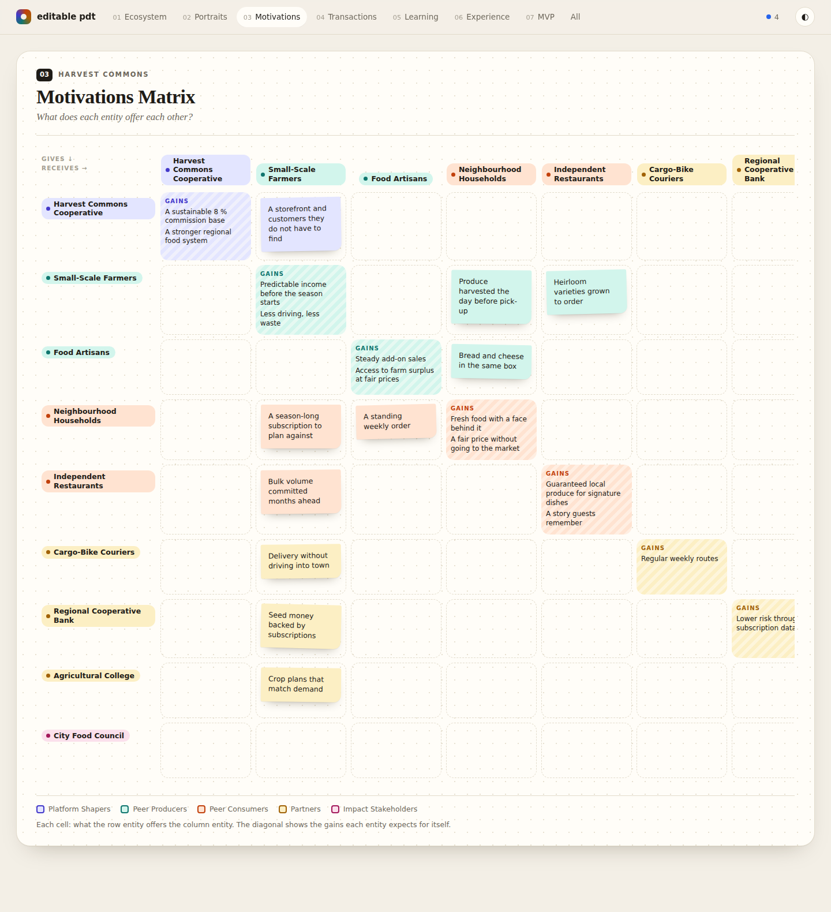
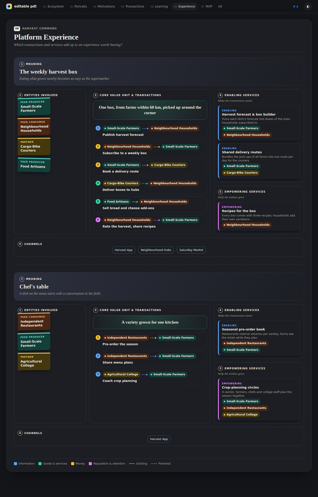
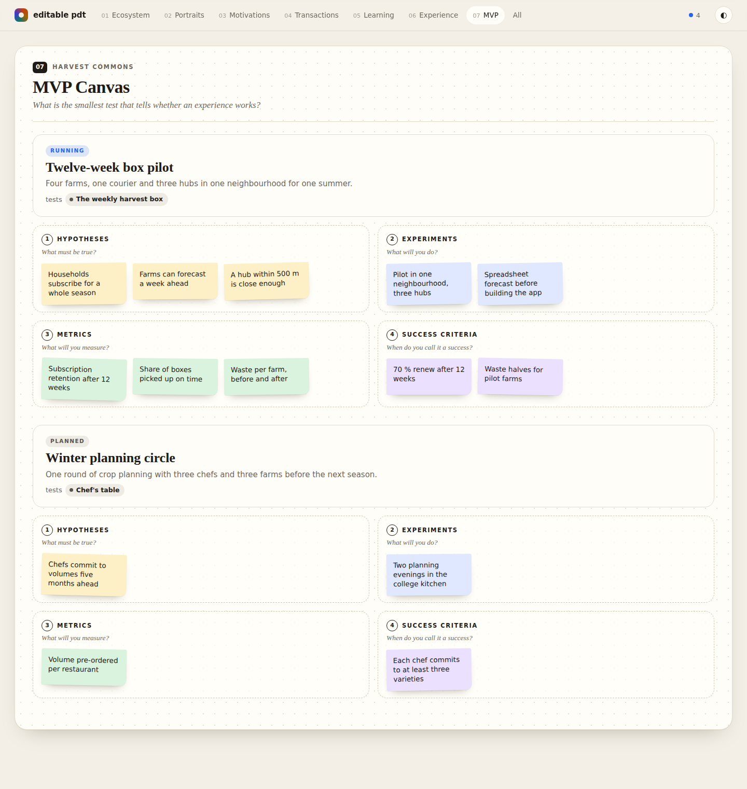

# editable-pdt

**Platform design as a language: canvases you can read, edit, validate and diff.**

Canvases on a wall look great at the workshop. A week later they are photos in a shared drive.
Nobody updates them, and nobody notices that the transaction on one canvas has no entity on
another.

editable-pdt keeps a platform design the way [arc42-language](https://github.com/docToolchain/arc42-language)
keeps an architecture:

- **Human-readable first.** Plain Markdown (`.pdt.md`) with prose that explains *why*, plus typed
  `:::block` fences for the structured part.
- **Machine-verifiable second.** One meta-model connects entities, transactions, services,
  experiences and MVPs, and a validator checks that they fit together.
- **Beautiful when rendered.** Every canvas is drawn from the same model, so a change shows up on
  every canvas at once. Edit on the canvas and the Markdown changes. Edit the Markdown and the
  canvas changes.



The canvases and their sequence are inspired by Boundaryless'
[Platform Design Toolkit](https://boundaryless.io/pdt-toolkit/). This is an independent project,
not affiliated with or endorsed by Boundaryless.

## Try it

```bash
git clone https://github.com/mrsimpson/editable-pdt.git
cd editable-pdt
node bin/pdt.js --dir examples/local-food-network serve
# → http://localhost:4242
```

No dependencies — Node.js ≥ 20 is all it needs.

Click any sticky to edit it. Use **+ Add** in any zone to create an element there. Press
<kbd>⌘S</kbd> or <kbd>Ctrl+S</kbd> to save. Each save rewrites only the lines of that one block
in its `.pdt.md` file, so your prose and layout stay as they are. When the files change on disk
(your editor, `git checkout`, a coding agent), every open browser reloads.



## The canvases

| # | Canvas | Question | Built from |
|---|--------|----------|------------|
| 01 | **Ecosystem Canvas** | Who is part of the ecosystem, and what role do they play? | `platform`, `entity` |
| 02 | **Entity Portraits** | What drives each entity, and what does it bring? | `entity` |
| 03 | **Motivations Matrix** | What does each entity offer each other? | `entity`, `motivation` |
| 04 | **Transactions Board** | What flows between entities today, and what could flow tomorrow? | `transaction`, `channel` |
| 05 | **Learning Engine** | How does the platform help entities grow? | `learning-engine`, `service` |
| 06 | **Platform Experience** | Which transactions and services add up to an experience worth having? | `experience`, `service`, `transaction` |
| 07 | **MVP Canvas** | What is the smallest test that tells whether an experience works? | `mvp` |

<table>
<tr>
<td></td>
<td></td>
</tr>
<tr>
<td></td>
<td></td>
</tr>
<tr>
<td></td>
<td></td>
</tr>
</table>

## The format

Each element gets its own section: a heading, prose that explains it, then the block.

````markdown
## Small-Scale Farmers

Family farms of two to twenty hectares within 60 km of the city. They sell at markets
and throw away up to a fifth of what they harvest.

```pdt
:::entity
id: e-farmers
title: Small-Scale Farmers
role: peer-producer
pressures:
  - Volatile demand, up to 20 % waste
  - Rising fuel and labour costs
gains:
  - Predictable income before the season starts
:::
```
````

- References are ids: `from: e-farmers`, or a comma-separated list: `entities: e-farmers, e-households`.
- Lists are indented `- item` lines. Each item becomes one sticky on the canvas.
- One file per chapter is the convention (`01-platform.pdt.md` … `07-mvp.pdt.md`). Any
  `*.pdt.md` file below `--dir` is read.

### The meta-model

```
platform ──shapers──▶ entity ◀──from/to── motivation
                        ▲  ▲
               from/to  │  │ entity
                        │  learning-engine ──steps──▶ service (empowering)
     channel ◀── transaction ◀──supports── service (enabling)
                        ▲                    ▲
          transactions  │                    │ services
                     experience ◀──experience── mvp
```

| Block | Purpose | Key attributes |
|-------|---------|----------------|
| `platform` | Name, purpose and core value unit (one per workspace) | `purpose`, `shapers`, `core-value` |
| `entity` | A role in the ecosystem and its portrait | `role` (`shaper`, `peer-producer`, `peer-consumer`, `partner`, `stakeholder`), `context`, `pressures`, `gains`, `seeks`, `resources` |
| `motivation` | What one entity offers another | `from`, `to`, `gives` |
| `channel` | Where transactions happen | `medium` (`digital`, `physical`, `hybrid`) |
| `transaction` | A flow between two entities | `from`, `to`, `flow` (`information`, `value`, `money`, `reputation`), `status` (`existing`, `potential`), `channel` |
| `service` | What the platform offers | `kind` (`enabling`, `empowering`), `for`, `supports`, `channel` |
| `learning-engine` | How an entity evolves | `entity`, `current`, `desired`, `steps` |
| `experience` | Transactions and services that deliver value | `entities`, `transactions`, `services`, `core-value`, `meaning` |
| `mvp` | The test of an experience | `experience`, `status`, `hypotheses`, `experiments`, `metrics`, `criteria` |

`pdt explain <type>` prints the full attribute list with an example.

## The CLI

```bash
pdt --dir <workspace> validate          # errors, warnings and hints; exit 1 on errors
pdt --dir <workspace> validate --strict # also fail on warnings
pdt --dir <workspace> get               # all elements grouped by type
pdt --dir <workspace> get e-farmers     # one element and what references it
pdt rules                               # every rule with its rationale
pdt explain [type]                      # the meta-model
pdt --dir <workspace> serve             # live, editable canvases
pdt --dir <workspace> build --out site  # static single-file HTML, works from disk
pdt init my-platform                    # start from the starter template
```

`--format json` gives machine-readable output for `validate`, `get`, `rules` and `explain`.
`--dir` defaults to `$PDT_DIR` or the current directory.

### Validation

The rules follow the logic of the toolkit, not just the syntax:

- **Errors** — the model is broken: duplicate ids, unresolved or wrongly typed references,
  missing required attributes, invalid values, unreadable blocks, a second platform.
- **Warnings** — the model contradicts itself: an entity in no transaction, a transaction with
  itself, a block without prose, an enabling service used as a learning step, an experience
  without transactions, a motivation with no transaction behind it, an experience that includes
  a transaction between entities outside it.
- **Hints** — the design has gaps: portraits without pressures or gains, peers without a
  learning engine, potential transactions no experience delivers, experiences without an MVP,
  MVPs without metrics.

Intentional exceptions are suppressed per file, inside any `pdt` fence:

```pdt
:::ignore H002 Restaurants grow through the chef's table, not a separate engine :::
```

## For agents

`.agents/skills/pdt-language/SKILL.md` teaches coding agents the format and the workflow. With
`pdt serve` running, you watch the canvases update while the agent edits the files.

## Development

```bash
npm test                    # node:test, no dependencies
npm run validate:example
npm run serve:example
```

```
src/core/     parser, schema (meta-model), model builder, validator, source writer — isomorphic
src/render/   canvas renderers (pure functions → HTML/SVG strings), page shell, theme.css
src/web/      the browser editor used by `pdt serve`
src/          workspace.js (file system), server.js (HTTP + live reload)
bin/pdt.js    CLI
```

The renderers run unchanged in Node (`pdt build`) and in the browser (`pdt serve`). So the
static site and the live editor always look the same.
